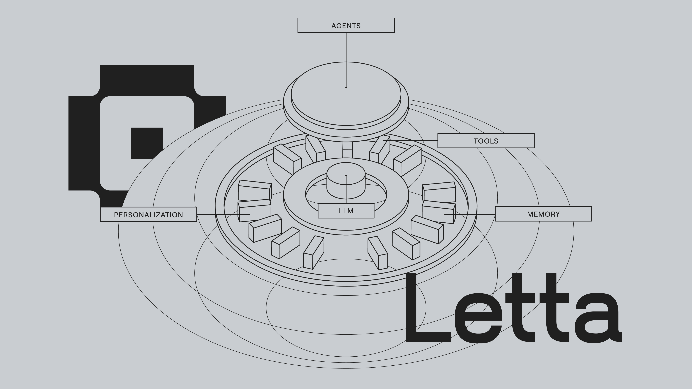

## Hello World 👾



Letta is the platform for building deeply personalized, stateful AI agents that remember you and learn over time.

Try [Letta Code](https://github.com/letta-ai/letta-code) to deploy a stateful agent on your own computer:
```bash
npm install -g @letta-ai/letta-code

# then navigate to a project directory, and run `letta`
cd my-project
letta
```

Useful links:
* Read our docs to learn about [Letta Code](https://docs.letta.com/letta-code) and the [Letta API](https://docs.letta.com/)
* Follow our [X/Twitter](https://x.com/Letta_AI/) for product updates
* Join our [Discord server](https://discord.gg/letta)

Letta is made with 💜 by our team in San Francisco ([join us!](https://jobs.ashbyhq.com/letta)) and over 100 individual contributors from around the world.
