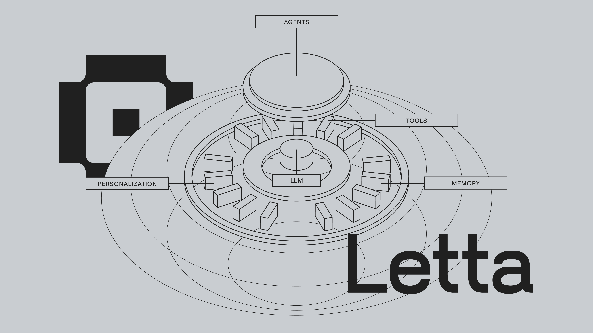

## Hello World 👾

[Letta](https://letta.com) adds state to your LLMs to give them advanced reasoning capabilities and transparent long-term memory. You can use Letta to create powerful LLM agents that can reason about their past interactions, learn from them, and improve their behavior over time.

* The Letta open source framework is available at [github.com/letta-ai/letta](https://github.com/letta-ai/letta)
* Chat with our team and other Letta user/developers on [Discord](https://discord.gg/letta)

Letta is made with ❤️ by our team in San Francisco ([join us!](https://letta.com#careers)) and over 100 individual contributors from around the world.
